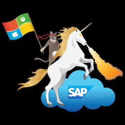

###  SAP Automation <!-- omit in toc -->
# Contributing Guidelines <!-- omit in toc -->

Master Branch's status: 
 
Thanks for taking the time to contribute!
This document summarizes the deployment principles which govern our project.
 
## Building "in the Open"
* Our users appreciate the transparency of our project; in this context, building "in the open" means that anyone can:
  * see the individual pull requests this solution is comprised of;
  * understand particular changes by going back and forth between pull requests;
  * submit pull requests with their own changes following the [Coding Guidelines](#CodingGuidelines).
* In addition, we use open-source software (OSS) tools rather than proprietary technology to build the solution.
 
## Fully Maintained
* Rather than providing a loose collection of scripts that are never updated, we fully maintain our project.
* We strive to provide a high-quality solution by:
  * continuously deploying it using an internal runner to ensure performance and stability;
  * detecting regressions introduced by code changes before merging them.
 
## Execution-focused
* We don't just work on some grand plan that may or never be completely executed;
  * It is encouraged to make changes to gradually improve old codebase to meet standards. However, we are not planning a refactor.
  * we start building out the solution and iterate towards a grand plan.
 
## Coding Guidelines
This repository integrates with [Azure Pipelines](https://azure.microsoft.com/en-us/services/devops/pipelines/), which invokes build checks on the submitted pull requests aginst defined branch(eg. master). All pull requests are required to pass the Azure pipelines test before it can be merged.
 
### PR Basics
This section captures fundamentals on how new features should be developed and fixes made to the codebase.

1. **Close on design before sending PRs**
	1. Add and describe design by creating an issue [here](https://github.com/Azure/sap-hana/issues). Discussions on the design will happen in the issue page. How? please take a look at the [example](https://github.com/Azure/sap-hana/issues/337).
	1. For sizable features, please request a design meeting.
	1. In the design meeting, the expectation is all attendees have reviewed the design. 
1. **Design for modularity, easy versioning, easy deployment and rollback **
	1. The design has to make sure it is independent and has minimum impact on other modules.
	1. There should be a set of test cases in places to prove the design works and will not break existing code.
1. **PR guidelines**
    1. Required information in PR ([example](https://github.com/Azure/sap-hana/pull/480)):
	    1. Always link to the issue that is is trying to resolve with tag **Close**.
	    1. Describe the **Problem** that it tries to resolve.
	    1. Provide the **Solution** that this PR contains.
	    1. Provide **Test** that has been done to make sure this PR does not break existing code (either in master or branch). If the test requires certain instructions, please add that information as well.
	1. The PRs should be easily tested independent of other projects in progress.
	1. Submit PRs with small commits that make it easier to rollback in case of problem.
	1. If it requires several PRs for a design, please create a feature branch, and submit PR against the feature branch instead of master (*Make sure you alert the admin of the github repo to add the feature branch into Azure pipeline so we make sure your PR will be tested*).
 
### PR reviews guidelines
We need to ensure quality along with agility. We need to move to everyone agreeing on the base requirement and then relying on systems in place to catch and mitigate issues.
1. Focus on the [**Basics**](#Basics). PRs have to adhere to Basics with no exceptions.
1. In additional to Basics, PR reviews need to focus on the quality of a PR. eg. caching potential issues/bugs, semantic problem, nitpick, etc...
1.  Keep PRs in an open published state for at least one working day, which would allow everyone in other regions to review.
1. For hotfixes, keep PRs open for at least 4 hrs.
1. The maintainer is [here](https://github.com/Azure/sap-hana/blob/master/CODEOWNERS).