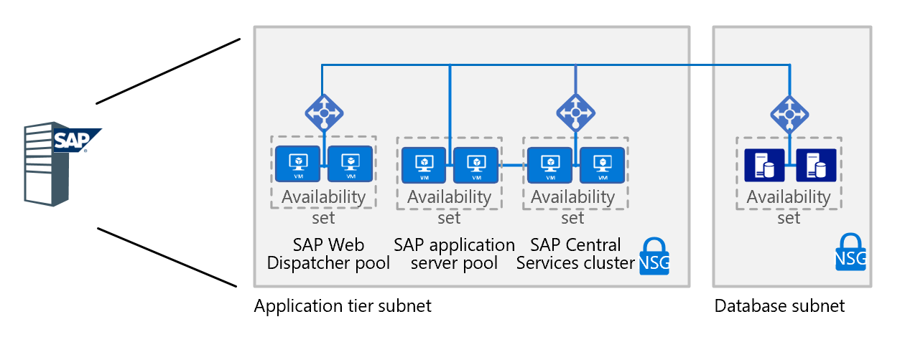

###  SAP Deployment Automation Framework <!-- omit in toc -->
<br/><br/>

# SDU - SAP Deployment Unit <!-- omit in toc -->

<br/>

## Table of contents <!-- omit in toc -->

- [Overview](#overview)
- [Notes](#notes)
- [Procedure](#procedure)
  - [SDU - SAP Deployment Unit](#sdu---sap-deployment-unit)


<br/>

## Overview



|                  |              |
| ---------------- | ------------ |
| Duration of Task | `5 minutes`  |
| Steps            | `6`          |
| Runtime          | `10 minutes`  |

---

<br/><br/>

## Notes

- For the workshop the *default* naming convention is referenced and used. For the **Deployer** there are three fields.
  - `<ENV>`-`<REGION>`-`<SAP_VNET>`-`<SAP_SID>`

    | Field        | Legnth   | Value  |
    | ------------ | -------- | ------ |
    | `<ENV>`      | [5 CHAR] | NP     |
    | `<REGION>`   | [4 CHAR] | EUS2   |
    | `<SAP_VNET>` | [7 CHAR] | SAP00  |
    | `<SAP_SID>`  | [3 CHAR] | X00    |
  
    Which becomes this: **DEMO-EUS2-SAP00-X00**
    
    This is used in several places:
    - The path of the Workspace Directory.
    - Input JSON file name
    - Resource Group Name.

    You will also see elements cascade into other places.

<br/><br/>

## Procedure

### SDU - SAP Deployment Unit

<br/>

1. Create Working Directory.
    <br/>*`Observe Naming Convention`*<br/>
    ```bash
    mkdir -p ~/Azure_SAP_Automated_Deployment/WORKSPACES/SYSTEM/DEMO-EUS2-SAP00-X00; cd $_
    ```
    <br/>

2. Create *backend* parameter file.
    <br/>*`Observe Naming Convention`*<br/>
    ```bash
    cat <<EOF > backend
    resource_group_name   = "DEMO-EUS2-SAP_LIBRARY"
    storage_account_name  = "<tfstate_storage_account_name>"
    container_name        = "tfstate"
    key                   = "DEMO-EUS2-SAP00-X00.terraform.tfstate"
    EOF
    ```
    |                      |           |
    | -------------------- | --------- |
    | resource_group_name  | The name of the Resource Group where the TFSTATE Storage Account is located. |
    | storage_account_name | The name of the Storage Account that was deployed durring the SAP_LIBRARY deployment, used used for the TFSTATE files. |
    | key                  | A composit of the `SAP Deployment Unit` Resource Group name and the `.terraform.tfstate` extension. |
    <br/>

3. Create input parameter [JSON](templates/DEMO-EUS2-SAP00-X00.json)
    <br/>*`Observe Naming Convention`*<br/>
    ```bash
    cat <<EOF > DEMO-EUS2-SAP00-X00.json
    {
      "tfstate_resource_id"                   : "<RESOURCE_ID_FOR_TFSTATE_STORAGE_ACCOUNT>",
      "deployer_tfstate_key"                  : "DEMO-EUS2-DEP00-INFRASTRUCTURE.terraform.tfstate",
      "landscape_tfstate_key"                 : "DEMO-EUS2-SAP00-INFRASTRUCTURE.terraform.tfstate",
      "infrastructure": {
        "environment"                         : "DEMO",
        "region"                              : "eastus2",
        "vnets": {
          "sap": {
            "name"                            : "SAP00",
            "subnet_db": {
              "prefix"                        : "10.1.1.0/28"
            },
            "subnet_web": {
              "prefix"                        : "10.1.1.16/28"
            },
            "subnet_app": {
              "prefix"                        : "10.1.1.32/27"
            },
            "subnet_admin": {
              "prefix"                        : "10.1.1.64/27"
            }
          }
        }
      },
      "databases": [
        {
          "platform"                          : "HANA",
          "high_availability"                 : false,
          "size"                              : "S4Demo",
          "os": {
            "publisher"                       : "SUSE",
            "offer"                           : "sles-sap-12-sp5",
            "sku"                             : "gen2",
            "version"                         : "latest"
          }
        }
      ],
      "application": {
        "enable_deployment"                   : true,
        "sid"                                 : "X00",
        "scs_instance_number"                 : "00",
        "ers_instance_number"                 : "10",
        "scs_high_availability"               : false,
        "application_server_count"            : 3,
        "webdispatcher_count"                 : 1,
        "authentication": {
          "type"                              : "key",
          "username"                          : "azureadm"
        }
      }
    }
    EOF
    ```
    <br/>

4. Terraform
    1. Initialization
       ```bash
       terraform init  --backend-config backend                                        \
                       ../../../sap-hana/deploy/terraform/run/sap_system/
       ```

    2. Plan
       <br/>*`Observe Naming Convention`*<br/>
       ```bash
       terraform plan  --var-file=DEMO-EUS2-SAP00-X00.json                                \
                       ../../../sap-hana/deploy/terraform/run/sap_system/
       ```

    3. Apply
       <br/>*`Observe Naming Convention`*<br/>
       ```bash
       terraform apply --auto-approve                                                  \
                       --var-file=DEMO-EUS2-SAP00-X00.json                               \
                       ../../../sap-hana/deploy/terraform/run/sap_system/
       ```
       <br/>


<br/><br/><br/><br/>
