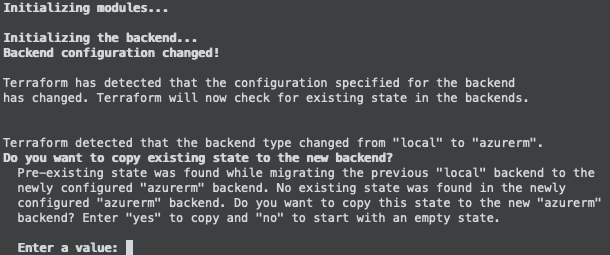

###  SAP Deployment Automation Framework <!-- omit in toc -->
<br/><br/>

# Bootstrap - Reinitialization <!-- omit in toc -->

<br/>

## Table of contents <!-- omit in toc -->

- [Overview](#overview)
- [Notes](#notes)
- [Procedure](#procedure)
  - [Deployer](#deployer)
  - [SAP Library](#sap-library)

<br/>

## Overview

|                  |              |
| ---------------- | ------------ |
| Duration of Task | `3 minutes`  |
| Steps            | `5`          |
| Runtime          | `1 minutes`  |

---

<br/><br/>

## Notes

- For the workshop the *default* naming convention is referenced and used. For the **Deployer** there are three fields.
  - `<ENV>`-`<REGION>`-`<DEPLOYER_VNET>`-INFRASTRUCTURE

    | Field             | Legnth   | Value  |
    | ----------------- | -------- | ------ |
    | `<ENV>`           | [5 CHAR] | NP     |
    | `<REGION>`        | [4 CHAR] | EUS2   |
    | `<DEPLOYER_VNET>` | [7 CHAR] | DEP00  |
  
    Which becomes this: **NP-EUS2-DEP00-INFRASTRUCTURE**
    
    This is used in several places:
    - The path of the Workspace Directory.
    - Input JSON file name
    - Resource Group Name.

    You will also see elements cascade into other places.

<br/><br/>

## Procedure

<br/>

### Deployer

<br/>

1. Change to Working Directory.
    <br/>*`Observe Naming Convention`*<br/>
    ```bash
    cd ~/Azure_SAP_Automated_Deployment/WORKSPACES/LOCAL/NP-EUS2-DEP00-INFRASTRUCTURE
    ```
    <br/>

2. Create *backend* parameter file.
    <br/>*`Observe Naming Convention`*<br/>
    ```bash
    cat <<EOF > backend
    resource_group_name   = "NP-EUS2-SAP_LIBRARY"
    storage_account_name  = "<tfstate_storage_account_name>"
    container_name        = "tfstate"
    key                   = "NP-EUS2-DEP00-INFRASTRUCTURE.terraform.tfstate"
    EOF
    ```
    |                      |           |
    | -------------------- | --------- |
    | resource_group_name  | The name of the Resource Group where the TFSTATE Storage Account is located. |
    | storage_account_name | The name of the Storage Account that was deployed durring the SAP_LIBRARY deployment, used used for the TFSTATE files. |
    | key                  | A composit of the `Deployer` Resource Group name and the `.terraform.tfstate` extension. |
    <br/>

3. Terraform
    1. Initialization
       ```bash
       terraform init  --backend-config backend                                        \
                       ../../../sap-hana/deploy/terraform/run/sap_deployer/
       ```
       
       Respond ***yes*** to the following:
       <br/><br/>

    2. Remove the local State File.

       ```bash
       rm terraform.tfstate*
       ```

    3. Plan
       <br/>*`Observe Naming Convention`*<br/>
       ```bash
       terraform plan  --var-file=NP-EUS2-DEP00-INFRASTRUCTURE.json                    \
                       ../../../sap-hana/deploy/terraform/run/sap_deployer/
       ```

    4. Apply
       <br/>*`Observe Naming Convention`*<br/>
       ```bash
       terraform apply --auto-approve                                                  \
                       --var-file=NP-EUS2-DEP00-INFRASTRUCTURE.json                    \
                       ../../../sap-hana/deploy/terraform/run/sap_deployer/
       ```

<br/><br/>

---

<br/><br/>

### SAP Library

<br/>

1. Change to Working Directory.
    <br/>*`Observe Naming Convention`*<br/>
    ```bash
    cd ~/Azure_SAP_Automated_Deployment/WORKSPACES/LIBRARY/NP-EUS2-SAP_LIBRARY
    ```
    <br/>

2. Create *backend* parameter file.
    <br/>*`Observe Naming Convention`*<br/>
    ```bash
    cat <<EOF > backend
    resource_group_name   = "NP-EUS2-SAP_LIBRARY"
    storage_account_name  = "<tfstate_storage_account_name>"
    container_name        = "tfstate"
    key                   = "NP-EUS2-SAP_LIBRARY.terraform.tfstate"
    EOF
    ```
    |                      |           |
    | -------------------- | --------- |
    | resource_group_name  | The name of the Resource Group where the TFSTATE Storage Account is located. |
    | storage_account_name | The name of the Storage Account that was deployed durring the SAP_LIBRARY deployment, used used for the TFSTATE files. |
    | key                  | A composit of the `SAP Library` Resource Group name and the `.terraform.tfstate` extension. |
    <br/>

3. Add Key/Pair `tfstate_resource_id` to the input JSON.
   <br/>
   It should be inserted as the first line following the opening `{`
    ```
    {
        "tfstate_resource_id"                   : "<RESOURCE_ID_FOR_TFSTATE_STORAGE_ACCOUNT>",
        "deployer_tfstate_key"                  : "<DEPLOYER_STATE_FILE_KEY_NAME>",
        "infrastructure": {
            ...
    }
    ```

4. Terraform
    1. Initialization
       ```bash
       terraform init  --backend-config backend                                        \
                       ../../../sap-hana/deploy/terraform/run/sap_library/
       ```
       
       Respond ***yes*** to the following:
       <br/><br/>

    2. Remove the local State File.

       ```bash
       rm terraform.tfstate*
       ```

    3. Plan
       <br/>*`Observe Naming Convention`*<br/>
       ```bash
       terraform plan  --var-file=NP-EUS2-SAP_LIBRARY.json                             \
                       ../../../sap-hana/deploy/terraform/run/sap_library/
       ```

    4. Apply
       <br/>*`Observe Naming Convention`*<br/>
       ```bash
       terraform apply --auto-approve                                                  \
                       --var-file=NP-EUS2-SAP_LIBRARY.json                             \
                       ../../../sap-hana/deploy/terraform/run/sap_library/
       ```

<br/><br/><br/><br/>

# Next: [SAP Workload VNET](05-workload-vnet.md) <!-- omit in toc -->
