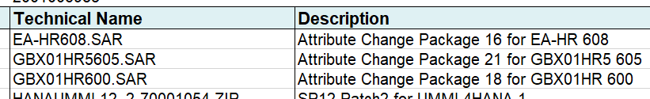

# Application BoM Preparation

:hand: The process documented here is sufficient to produce a functional BoM. However, it does not include steps for including SAP "permalinks" to media.

The process for generating a BoM which includes those is more complex and has additional acquisition steps which must be done during [Acquisition of Media](acquire-media.md) and before the SAP Download Manager is run. The process is documented [here](prepare-app-full-bom.md) for reference.

## Prerequisites

1. Microsoft Excel for viewing the Excel stack file spreadsheet.
1. An editor for creating the SAP Application BoM file.
1. Application installation template(s) for SCS and/or PAS/AAS uploaded to the Storage Account.
1. SAP Application media present on the Storage Account.
1. An empty folder in which to create the BoM file.

## Inputs

1. Stack files.

## Process

1. Download the associated stack files to your workstation's empty, working folder;
1. Create an empty text file called `bom.yml`.

   ```text
   .
   ├── bom.yml      <-- BoM content will go in here
   ├── MP_Excel_xxx.xls
   ├── MP_Plan_xxx.pdf
   ├── MP_Stack_xxx.txt
   ├── MP_Stack_xxx.xml
   └── myDownloadBasketFiles.txt
   ```

### Example Partial BoM File

An example of a small part of a BoM file for S/4HANA 1909 SP2. The `[x]` numbered sections are covered in the following documentation. Note that `v001` is a sequential number used to indicate the internal (non-SAP) version of the files included.

```text
step|BoM Content
    |
    |---
    |
[1] |name:    'S4HANA_2020_ISS_v001'
[2] |target:  'ABAP PLATFORM 1909'
[3] |version: 001
    |
[4] |defaults:
    |  archive_location: "https://npweeusaplib9545.file.core.windows.net/sapbits/archives/"
    |  target_location: "/usr/sap/downloads/"
    |
[5] |materials:
[6] |  dependencies:
    |    - name:     HANA2_00_052_v001
    |      version:  001
    |
[7] |  media:
    |    - name:     SAPCAR
    |      version:  7.21
    |      archive:  SAPCAR_1320-80000935.EXE
    |
    |    - name:     SWPM
    |      version:  2.0SP06
    |      archive:  SWPM20SP06_6-80003424.SAR
    |
    |    - name:     SAP IGS HELPER
    |      version:  7.20EXT
    |      archive:  igshelper_17-10010245.sar
    |
    |    - name:     SAP HR 6.08
    |      version:  608
    |      archive:  SAP_HR608.SAR
    |
    |    - name:     S4COREOP 104
    |      version:  104
    |      archive:  S4COREOP104.SAR
    |
[8] |  templates:
    |    - name:     "S4HANA_2020_ISS_v001 ini file"
    |      file:     "S4HANA_2020_ISS_v001.inifile.params"
```

### Create BoM Header

1. `[1]` and `[2]`: Record appropriate names for the build and target. The `name` must be the same as the BoM folder name in the Storage Account.

### Define BoM Version

1. `[3]` is an arbitrary number, chosen by you, which can be used to distinguish between any different versions you may have of this particular BoM. The value here should match the `_v...` numbering in the `bom.yml` parent folder, as described earlier.

### Create Defaults Section

1. `[4]`: This section contains:
   1. `archive_location`: The location to which you will upload the SAP build files. Also, the same location from which the files will be copied to the target server.
   1. `target_location`: The folder on the target server, into which the files will be copied for installation.

### Create Materials Section

1. `[5]`: Use exactly as shown. This specifies the start of the list of materials needed.

1. `[6]`: You may have dependencies on other BoMs (for example for HANA, as shown here). In order fully define the materials for this build, you should add these dependencies here.

### Create List of Media

1. `[7]`: Specify `media:` exactly as shown.

1. Using Microsoft Excel, open the download basket spreadsheet

1. Using your editor, transcribe the Description and Technical Name as `- name` and `archive` respectively into your `bom.yml` file. Do this for the *whole file* under a `media` section as indicated in the example. :information_source: The `version` property is optional.

   

   ```text
   - name: "Attribute Change Package 16 for EA-HR 608"
     version: 6.08
     archive: "EA-HR608.SAR"

   - name: "Attribute Change Package 21 for GBX01HR5 605"
     archive: "GBX01HR5605.SAR"

     ... etc ...
   ```

### Override Target Destination

Files downloaded or shared from the archive space will need to be extracted to the correct location on the target server. This is normally set using the `defaults -> target_location` property (see [the defaults section](#create-defaults-section)). However, you may override this on a case-by-case basis.

1. For each relevant entry in the BoM `media` section, add an `override_target_location:` property with the correct target folder. For example:

   ```text
   - name: "Kernel Part I"
     archive: "SAPEXE_200-80004393.SAR"
     override_target_location: "/usr/sap/install/download_basket/"

   - name: "Kernel Part II (777)"
     archive: "SAPEXEDB_200-80004392.SAR"
     override_target_location: "/usr/sap/install/download_basket/"
   ```

### Override Target Filename

By default, files downloaded or shared from the archive space will be extracted with the same filename as the `archive` filename on the target server.  However, you may override this on a case-by-case basis, although this is not normally necessary.

1. For each relevant entry in the BoM `media` section, add an `override_target_filename:` property with the correct target folder. For example:

   ```text
      - name:     SAPCAR
        version:  7.21
        archive:  SAPCAR_1320-80000935.EXE
        override_target_filename: SAPCAR.EXE
   ```

### Tidy Up Layout

The order of entries in the `media` section does not matter. However, for improved readability, you may wish to group related items together.

### Add Template Name

1. [8]: Create a `templates` section as shown, with the same filename prefix as the BoM `<stack_version>`.

   ```text
     templates:
       - name:     "S4HANA_2020_ISS_v001 ini file"
         file:     "S4HANA_2020_ISS_v001.inifile.params"
   ```

### Upload Files to Archive Location

1. From the correct Azure storage account, navigate to "Containers", then to "sapbits";
1. In the panel on the right, click Select a file;
1. Navigate your workstation to your working directory;
1. Select `bom.yml`;
1. Click Advanced to show the advanced options, and enter `bomss/<Stack_Version>` for the Upload Directory.

## Results and Outputs

1. A `bom.yml` file present in the Storage Account in the correct location. In this example, `sapbits/boms/S4HANA_2020_ISS_v001/bom.yml`.
