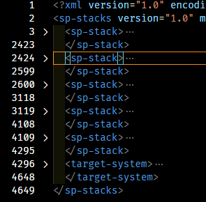
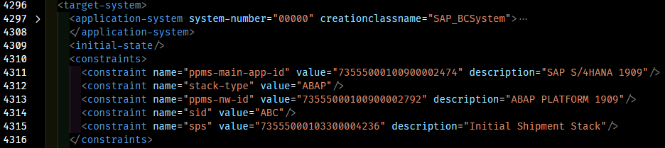

# Manual BoM Generation

<!-- TOC depthFrom:2 -->

- [Requirements](#requirements)
- [Preparation](#preparation)
- [Get the SAP Download Basket Manifest](#get-the-sap-download-basket-manifest)
- [Download SAP Build Files](#download-sap-build-files)
- [Example Partial BoM File](#example-partial-bom-file)
- [Create BoM Header](#create-bom-header)
- [Determine SAP Embedded Names](#determine-sap-embedded-names)
- [Define BoM Version](#define-bom-version)
- [Create Defaults Section](#create-defaults-section)
- [Create Materials Section](#create-materials-section)
- [Create List of Media](#create-list-of-media)
- [Include SAP Permalink References](#include-sap-permalink-references)
- [Override Target Destination](#override-target-destination)
- [Override Target Filename](#override-target-filename)
- [Tidy Up Layout](#tidy-up-layout)
- [Upload Files to Archive Location](#upload-files-to-archive-location)
- [Overview of Storage Lifecycle](#overview-of-storage-lifecycle)
  - [Workstation](#workstation)
  - [NFS](#nfs)
  - [Target](#target)

<!-- /TOC -->

## Requirements

:hand: It is important that BoM files are constructed from one product at a time, with the SAP download basket being emptied before each BoM generation.

It is assumed you have access to the SAP Maintenance Planner and Download Basket and the SAP Download Manager application. Use of these resources is not covered in this document.

1. An empty base folder (directory) on your workstation in which to create the required structure and files.
1. A Linux or MAC based workstation with the [`postman`](https://www.postman.com/downloads/) utility.
1. An editor (or IDE) able to reformat XML and JSON to make it more human-readable.
1. The Download Basket Manifest file from the SAP Download Manager.
1. The XML Stack file from the SAP Maintenance Planner.

## Preparation

Your workstation's empty base folder will be used to save all downloaded SAP archive files, stack files and the BoM file.

1. Within your workstation's base folder, create folders called `archives`, `boms` and `templates`.

   ```text
   .
   ├── archives/
   ├── boms/
   └── templates/
   ```

1. Within the `boms` folder create a new folder for the product you are building (in this example called `S4HANA_1909_SP2_v001`).

1. Within the `S4HANA_1909_SP2_v001` folder, create a new folder called `stackfiles` and an empty text file called `bom.yml`.

   ```text
   .
   ├── archives/
   ├── boms/
   │   ├── bom.yml      <-- BoM content will go in here
   │   └── stackfiles/  <-- SAP stack files will go in here
   └── templates/
   ```

1. Using the SAP Maintenance Planner design your new system and ensure you download the various stack files (`MP_Excel_xxx.xls`, `MP_Plan_xxx.pdf`, `MP_Stack_xxx.txt`, `MP_Stack_xxx.xml`, `myDownloadBasketFiles.txt`) into the `stackfiles/` folder.

   ```text
   .
   ├── archives/
   ├── boms/
   │   └── S4HANA_1909_SP2_v001
   │       ├── bom.yml
   │       └── stackfiles
   │           ├── MP_Excel_xxx.xls
   │           ├── MP_Plan_xxx.pdf
   │           ├── MP_Stack_xxx.txt
   │           ├── MP_Stack_xxx.xml
   │           └── myDownloadBasketFiles.txt
   └── templates/
   ```

1. Ensure you push your build file list to the SAP Download Basket. :hand: Do not run the SAP Download Manager to download the build files until after completing the next step.

## Get the SAP Download Basket Manifest

Ensure you do this **before** running SAP Download Manager.

1. Start the `postman` utility and create a new `GET` request by clicking the :heavy_plus_sign: in the workspace tab.

   

1. Ensure `GET` is selected and enter the request URL as `https://tech.support.sap.com:443/odata/svt/swdcuisrv/DownloadContentSet?_MODE=BASKET_CONTENT&_VERSION=3.1.2&$format=json`

   

1. Select the `Authorization` tab and choose `TYPE` as `Basic Auth` and enter your SAP user name and password in the appropriate fields.

   

1. Click the blue `Send` button.

1. Copy the Raw JSON response body and save it in `DownloadBasket.json` in the `stackfiles/` folder on your workstation.

   

## Download SAP Build Files

Using the SAP Download Manager, download the contents of the Download Basket to your workstation's base folder.

```text
   .
   ├── archives/
   │   ├── K-80401INMDGUX.SAR
   │   ├── S4CORE104_INST_EXPORT_1.zip
   │   ├── S4CORE104_INST_EXPORT_2.zip
   │   ├── SAP_BASIS754.SAR
   │   └── ... etc
   ├── boms/
   │   └── S4HANA_1909_SP2_v001
   │       ├── bom.yml
   │       └── stackfiles
   │           ├── DownloadBasket.json
   │           ├── MP_Excel_xxx.xls
   │           ├── MP_Plan_xxx.pdf
   │           ├── MP_Stack_xxx.txt
   │           ├── MP_Stack_xxx.xml
   │           └── myDownloadBasketFiles.txt
   └── templates/
```

1. From SAP Launchpad, download the latest version of SAPCAR into the same folder.

## Example Partial BoM File

An example of a small part of a BoM file for S/4HANA 1909 SP2. The `[x]` numbered sections are covered in the following documentation. Note that `v001` is a sequential number used to indicate the internal (non-SAP) version of the files included.

```text
step|BoM Content
    |
    |---
    |
[1] |name:    'S/4HANA 1909 SP2'
[2] |target:  'ABAP PLATFORM 1909'
[3] |version: 001
    |
[4] |defaults:
    |  archive_location: "https://npweeusaplib9545.file.core.windows.net/sapbits/archives/"
    |  target_location: "/usr/sap/install/downloads/"
    |
[5] |materials:
[6] |  dependencies:
    |    - name:     HANA2
    |      version:  003
    |
[7] |  media:
    |    - name:     SAPCAR
    |      version:  7.21
    |      archive:  SAPCAR_1320-80000935.EXE
    |
    |    - name:     SWPM
    |      version:  2.0SP06
    |      archive:  SWPM20SP06_6-80003424.SAR
    |
    |    - name:     SAP IGS HELPER
    |      version:  7.20EXT
    |      archive:  igshelper_17-10010245.sar
    |
    |    - name:     SAP HR 6.08
    |      version:  608
    |      archive:  SAP_HR608.SAR
    |
    |    - name:     S4COREOP 104
    |      version:  104
    |      archive:  S4COREOP104.SAR
    |
[8] |  templates:
    |    - name:     SCS_INI
    |      version:  1909.2
    |      file:     scs_1909_v2.ini
    |
    |    - name:     SCS_XML
    |      version:  1909.1
    |      file:     scs_1909_v2.xml
```

## Create BoM Header

1. `[1]` and `[2]`: Record appropriate names for the build and target. If you want to use the embedded names in the SAP download, follow the next section.

## Determine SAP Embedded Names

1. Open the XML Stack file in your editor and ensure it's formatted to make it more human-readable. You will notice a number of `<sp-stack>...</sp-stack>` sections and a `<target-system>` section. This image shows the sections collapsed.

   

1. `[1]` and `[2]`: The `name` and `target` to use can be found in the `<target-system>` section at the end of the XML file.

   

   1. `name` is the description property in `<constraint name="ppms-main-app-id" value="73555000100900002474" description="SAP S/4HANA 1909"/>`
   1. `target` is the description property in `<constraint name="ppms-nw-id" value="73555000100900002792" description="ABAP PLATFORM 1909"/>`

## Define BoM Version

1. `[3]` is an arbitrary number, chosen by you, which can be used to distinguish between any different versions you may have of this particular BoM. The value here should match the `_v...` numbering in the `bom.yml` parent folder, as described earlier.

## Create Defaults Section

1. `[4]`: This section contains:
   1. `archive_location`: The location to which you will upload the SAP build files. Also, the same location from which the files will be copied to the target server.
   1. `target_location`: The folder on the target server, into which the files will be copied for installation.

## Create Materials Section

1. `[5]`: Use exactly as shown. This specifies the start of the list of materials needed.

1. `[6]`: You may have dependencies on other BoMs (for example for HANA, as shown here). In order fully define the materials for this build, you should add these dependencies here.

## Create List of Media

1. `[7]`: Specify `media:` exactly as shown.

1. :hand: Ensure you add SAPCAR - it will not be in the download basket. :information_source: The `version` property is optional.

   ```text
    media:
      - name:     SAPCAR
        version:  7.21
        archive:  SAPCAR_1320-80000935.EXE
   ```

1. Using **your editor**, open the download basket spreadsheet. This will render as XML.
1. Ensure the XML is formatted for human readability.
1. Using **your editor**, transcribe the description and filename as `- name` and `archive` respectively into your `bom.yml` file. Do this for the *whole file* under a `media` section as indicated in the example. :information_source: The `version` property is optional.
1. You will need the blue-ringed number later, so record it along with the entry you are making in your `bom.yml`. For example, add the number as a comment.

   

   ```text
   - name: "SAP IGS Fonts and Textures"
     archive: "igshelper_17-10010245.sar"
     # 61489

     ... etc ...
   ```

## Include SAP Permalink References

1. Open the `DownloadBasket.json` in your editor and reformat to make it more human readable.

   

1. For each of the `"Value":` lines, take the first, second and fourth items from the following vertical-bar separated values. For example:

   ```text
        "Value": "0020000000703122018|SP_B|SAP IGS Fonts and Textures|61489|1|20201023150931|0"
   ```

   Will give you `0020000000703122018`, `SP_B` and `61489`.

   Using the third value (61489 in this example) as a key, match up the results with the values you recorded as comments in the previous phase.

   ```text
   - name: "SAP IGS Fonts and Textures"
     archive: "igshelper_17-10010245.sar"
     # 61489
   ```

1. For each entry matched, add a `sapurl:` value based on the number up to the first vertical bar. Each entry should include the SAP software download URI location. You may delete the comment. For example:

   ```text
   ```text
   - name: "SAP IGS Fonts and Textures"
     archive: "igshelper_17-10010245.sar"
     sapurl: "https://softwaredownloads.sap.com/file/0020000000703122018"
   ```

1. The other part (`SP_B` in the examples shown) has these observed values:

   1. `SP_B`: These appear to be kernel binary files.
   1. `SPAT`: These appear to be non-kernel binary files.
   1. `CD`: These appear to be database exports.

## Override Target Destination

Files downloaded or shared from the archive space will need to be extracted to the correct location on the target server. This is normally set using the `defaults -> target_location` property (see [the defaults section](#red_circle-create-defaults-section)). However, you may override this on a case-by-case basis.

1. For each relevant entry in the BoM `media` section, add an `override_target_location:` property with the correct target folder. For example:

   ```text
   - name: "Kernel Part I"
     archive: "SAPEXE_200-80004393.SAR"
     sapurl: "https://softwaredownloads.sap.com/file/0020000001063232020"
     override_target_location: "/usr/sap/install/download_basket/"

   - name: "Kernel Part II (777)"
     archive: "SAPEXEDB_200-80004392.SAR"
     sapurl: "https://softwaredownloads.sap.com/file/0020000001063182020"
     override_target_location: "/usr/sap/install/download_basket/"
   ```

## Override Target Filename

By default, files downloaded or shared from the archive space will be extracted with the same filename as the `archive` filename on the target server.  However, you may override this on a case-by-case basis.

1. For each relevant entry in the BoM `media` section, add an `override_target_filename:` property with the correct target folder. For example:

   ```text
      - name:     SAPCAR
        version:  7.21
        archive:  SAPCAR_1320-80000935.EXE
        override_target_filename: SAPCAR.EXE
   ```

## Tidy Up Layout

The order of entries in the `media` section does not matter. However, for improved readability, you may wish to group related items together.

## Upload Files to Archive Location

1. From the correct Azure storage account, navigate to "File shares", then to "sapbits".
1. For each folder `archives`, `boms` and `templates` in sapbits:
   1. Click folder name in the portal to open, then:
   1. Click "Upload" and select all files in your equivalent folder for upload (your `archives` files are uploaded into `archives`, `boms` into `boms` and `templates` into `templates`).
   1. Ensure "Overwrite duplicates" is checked. :hand: There is no option to skip duplicates and the upload will not be allowed to commence if this option is not checked and there are duplicates.
   1. Click "Upload". The upload process is multi-threaded, so is relatively quick.

## Overview of Storage Lifecycle

### Workstation

All assets are placed into an otherwise empty folder and the BoM is set up. For example:

   ```text
   .
   ├── archives
   │   ├── K-80401INMDGUX.SAR
   │   ├── S4CORE104_INST_EXPORT_1.zip
   │   ├── S4CORE104_INST_EXPORT_2.zip
   │   ├── SAP_BASIS754.SAR
   │   └── ... etc
   ├── boms
   │   └── S4HANA_1809_SP2_v003/
   │       ├── bom.yml
   │       └── stackfiles/
   │           ├── MP_Excel_xxx.xls
   │           ├── MP_Plan_xxx.pdf
   │           ├── MP_Stack_xxx.txt
   │           ├── MP_Stack_xxx.xml
   │           └── myDownloadBasketFiles.txt
   └── templates
       └── S4HANA_1809_SP2_v003.ini
   ```

### NFS

Upload your folder contents into the `sapbits` folder. Your workstation folders and files will be merged with the existing contents. For example:

   ```text
   sapbits
   ├── archives
   │   ├── K-80401INMDGUX.SAR
   │   ├── S4CORE104_INST_EXPORT_1.zip
   │   ├── S4CORE104_INST_EXPORT_2.zip
   │   ├── S4CORE105_INST_EXPORT_1.zip
   │   ├── S4CORE105_INST_EXPORT_2.zip
   │   ├── SAP_BASIS754.SAR
   │   └── ... etc
   ├── boms
   │   ├── S4HANA_1809_SP2_v003/
   │   │   ├── bom.yml
   │   │   └── stackfiles/
   │   │       ├── MP_Excel_xxx.xls
   │   │       ├── MP_Plan_xxx.pdf
   │   │       ├── MP_Stack_xxx.txt
   │   │       ├── MP_Stack_xxx.xml
   │   │       └── myDownloadBasketFiles.txt
   │   ├── S4HANA_1909_SP2_v001/
   │   │   ├── bom.yml
   │   │   └── stackfiles/
   │   │       ├── MP_Excel_xxx.xls
   │   │       ├── MP_Plan_xxx.pdf
   │   │       ├── MP_Stack_xxx.txt
   │   │       ├── MP_Stack_xxx.xml
   │   │       └── myDownloadBasketFiles.txt
   │   └── S4HANA_2020_SP0_v001/
   │       ├── bom.yml
   │       └── stackfiles/
   │           ├── MP_Excel_xxx.xls
   │           ├── MP_Plan_xxx.pdf
   │           ├── MP_Stack_xxx.txt
   │           ├── MP_Stack_xxx.xml
   │           └── myDownloadBasketFiles.txt
   ├── templates
   │   ├── HANA2_sp05_v002.ini
   │   ├── S4HANA_1809_SP2_v003.ini
   │   ├── S4HANA_1909_SP2_v001.ini
   │   └── S4HANA_2020_SP0_v001.ini
   ```

### Target

1. The NFS storage is mounted.
1. The required media files are copied into a single folder on the target VM (`/usr/sap/install/downloads/`).
1. The stack XML file is copied onto the target VM (`/usr/sap/install/install/config/`).
1. The appropriate template `INI` files are copied onto the target VM.
