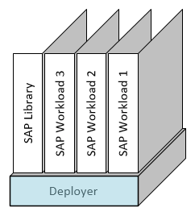
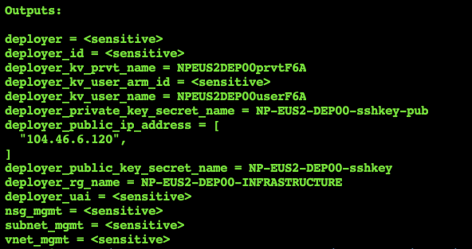

###  SAP Automation > V1.x.x <!-- omit in toc -->
# Bootstrapping the Deployer <!-- omit in toc -->

<br/>

## Table of contents <!-- omit in toc -->

- [Overview](#overview)
- [Notes](#notes)
- [Procedure](#procedure)
  - [Bootstrap - Deployer](#bootstrap---deployer)

<br/>

## Overview


|                  |              |
| ---------------- | ------------ |
| Duration of Task | `12 minutes` |
| Steps            | `10`         |
| Runtime          | `5 minutes`  |

---

<br/><br/>

## Notes

- For the workshop the *default* naming convention is referenced and used. For the **Deployer** there are three fields.
  - `<ENV>`-`<REGION>`-`<DEPLOYER_VNET>`-INFRASTRUCTURE

    | Field             | Legnth   | Value  |
    | ----------------- | -------- | ------ |
    | `<ENV>`           | [5 CHAR] | NP     |
    | `<REGION>`        | [4 CHAR] | EUS2   |
    | `<DEPLOYER_VNET>` | [7 CHAR] | DEP00  |
  
    Which becomes this: **NP-EUS2-DEP00-INFRASTRUCTURE**
    
    This is used in several places:
    - The path of the Workspace Directory.
    - Input JSON file name
    - Resource Group Name.

    You will also see elements cascade into other places.

<br/><br/>

## Procedure

### Bootstrap - Deployer

<br/>

1. Cloud Shell
   1. Log on to the [Azure Portal](https://portal.azure.com).
   2. Open the cloud shell.
      <br/>
      <br/><br/>

2. Ensure that you are authenticated with the correct subscription.
    ```bash
    az login
    az account list --output=table | grep -i true
    ```

    If not, then find and set the Default to the correct subscription.

    ```bash
    az account list --output=table
    az account set  --subscription XXXXXXXX-XXXX-XXXX-XXXX-XXXXXXXXXXXX
    ```
    <br/>

3. Install the correct version of Terraform.
    ```bash
    mkdir ~/bin; cd $_
    alias terraform=~/bin/terraform
    wget https://releases.hashicorp.com/terraform/0.12.29/terraform_0.12.29_linux_amd64.zip
    unzip terraform_0.12.29_linux_amd64.zip
    ```
    <br/>

4. Repository
   1. Clone the Repository and Checkout the branch.
        ```bash
        mkdir -p ~/Azure_SAP_Automated_Deployment; cd $_
        git clone https://github.com/Azure/sap-hana.git
        cd  ~/Azure_SAP_Automated_Deployment/sap-hana
        ```

    2. Checkout Branch
        ```bash
        git checkout feature/keyvault
        ```

    3. Verify Branch is at expected Revision
        ```bash
        git rev-parse HEAD
        ```
        <br/>

5. Create Working Directory.
    <br/>*`Observe Naming Convention`*<br/>
    ```bash
    mkdir -p ~/Azure_SAP_Automated_Deployment/WORKSPACES/LOCAL/NP-EUS2-DEP00-INFRASTRUCTURE; cd $_
    ```
    <br/>

6. Create input parameter [JSON](templates/NP-EUS2-DEP00-INFRASTRUCTURE.json)
    <br/>*`Observe Naming Convention`*<br/>
    ```bash
    vi NP-EUS2-DEP00-INFRASTRUCTURE.json
    ```
    <br/>

7.  Terraform
    1. Initialization
       ```bash
       terraform init  ../../../sap-hana/deploy/terraform/bootstrap/sap_deployer/
       ```

    2. Plan
       <br/>*`Observe Naming Convention`*<br/>
       ```bash
       terraform plan  --var-file=NP-EUS2-DEP00-INFRASTRUCTURE.json                    \
                       ../../../sap-hana/deploy/terraform/bootstrap/sap_deployer/
       ```

    3. Apply
       <br/>*`Observe Naming Convention`*<br/>
       *This step deploys the resources*
       ```bash
       terraform apply --auto-approve                                                  \
                       --var-file=NP-EUS2-DEP00-INFRASTRUCTURE.json                    \
                       ../../../sap-hana/deploy/terraform/bootstrap/sap_deployer/
       ```
        <br/>

8.  Post Processing
    1. In Output Section make note of the following 
       1. deployer_public_ip_address
       2. deployer_kv_user_name
       3. deployer_kv_prvt_name
       4. deployer_public_key_secret_name
       5. deployer_private_key_secret_name
      
          <br/>
          <br/><br/>

    2. Post Processing.
       ```bash
       ./post_deployment.sh
       ```
       <br/>

    3. Extract SSH Keys
       1. Private Key
          <br/>*`Observe Naming Convention`*<br/>
          ```
          az keyvault secret show            \
            --vault-name NPEUS2DEP00userF6A \
            --name NP-EUS2-DEP00-sshkey   | \
            jq -r .value > sshkey
          ```
          <br/>

       2. Public Key
          <br/>*`Observe Naming Convention`*<br/>
          ```
          az keyvault secret show               \
            --vault-name NPEUS2DEP00userF6A     \
            --name NP-EUS2-DEP00-sshkey-pub   | \
            jq -r .value > sshkey.pub
          ```
          <br/>

    4. Download the Private/Public Key Pair for use in your SSH Terminal Application
       <br/>

       <br/><br/><br/><br/>


# Next: [Bootstrap - SPN](02-spn.md) <!-- omit in toc -->
